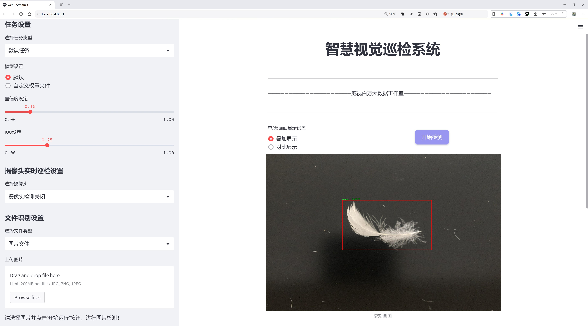
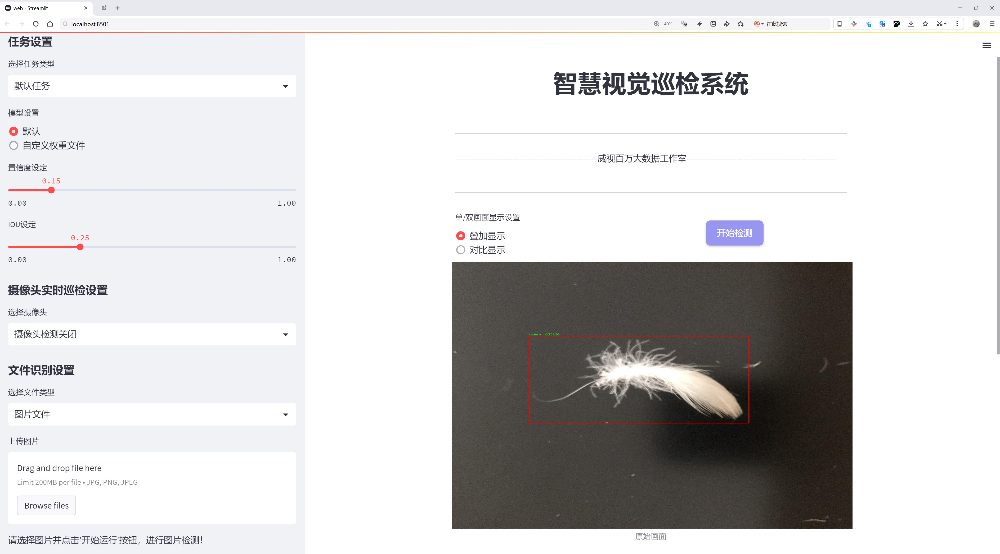
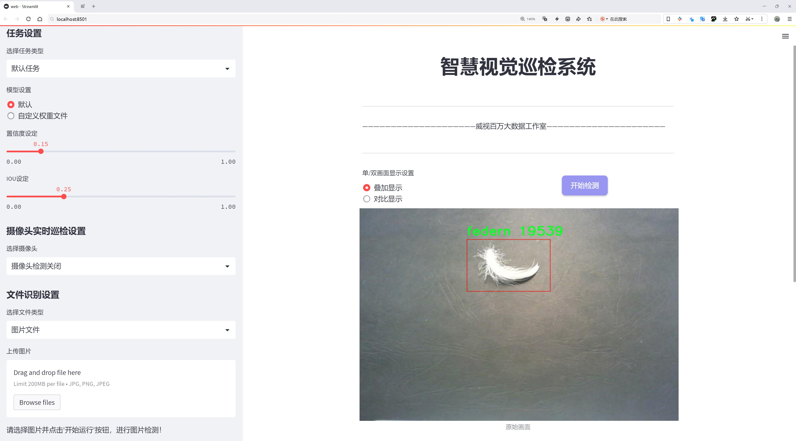
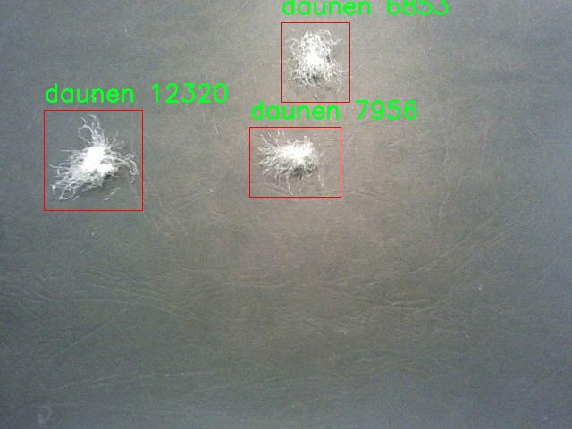
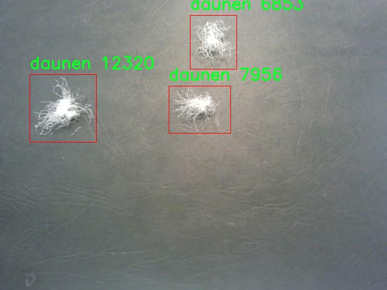
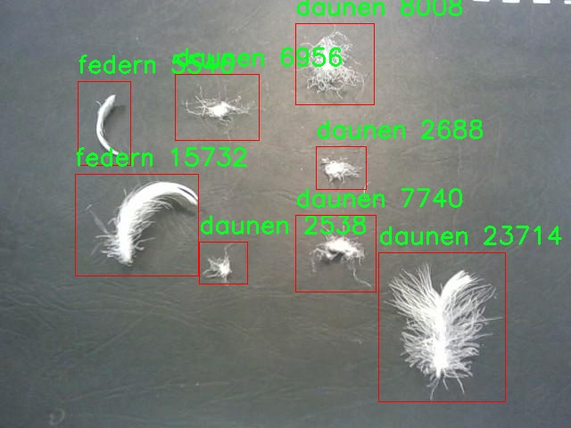
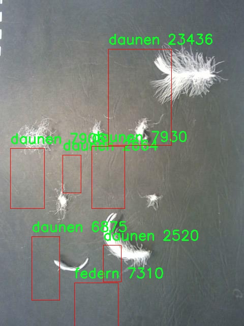
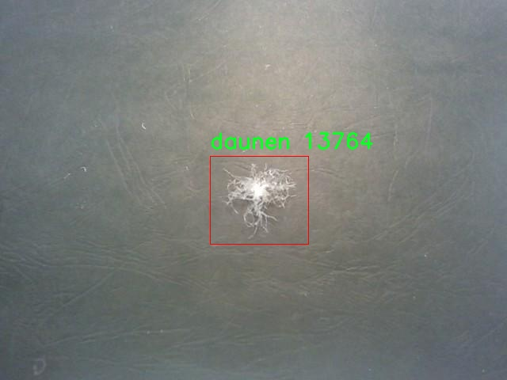

# 羽毛类型检测检测系统源码分享
 # [一条龙教学YOLOV8标注好的数据集一键训练_70+全套改进创新点发刊_Web前端展示]

### 1.研究背景与意义

项目参考[AAAI Association for the Advancement of Artificial Intelligence](https://gitee.com/qunmasj/projects)

项目来源[AACV Association for the Advancement of Computer Vision](https://kdocs.cn/l/cszuIiCKVNis)

研究背景与意义

随着计算机视觉技术的快速发展，物体检测已成为人工智能领域中的一个重要研究方向。特别是在工业和农业等领域，物体检测技术的应用愈发广泛。羽毛作为一种重要的自然资源，广泛应用于服装、家居用品及装饰品等多个行业。针对羽毛的类型检测，不仅有助于提高生产效率，还能有效降低人工成本，提高产品质量。因此，开发一种高效、准确的羽毛类型检测系统显得尤为重要。

在现有的物体检测算法中，YOLO（You Only Look Once）系列模型因其高效性和实时性而受到广泛关注。YOLOv8作为该系列的最新版本，具备了更强的特征提取能力和更快的推理速度，能够在复杂的环境中实现高精度的物体检测。然而，传统的YOLOv8模型在特定领域的应用时，往往需要进行针对性的改进，以适应特定数据集的特征和需求。因此，基于改进YOLOv8的羽毛类型检测系统的研究，具有重要的学术价值和实际意义。

本研究所使用的数据集Vocdevkit包含2600张图像，涵盖了两类羽毛：羽绒（daunen）和羽毛（federn）。这一数据集的构建为羽毛类型检测提供了良好的基础，然而，数据集的多样性和复杂性也对模型的训练和检测效果提出了挑战。为了提高模型在羽毛类型检测中的准确性和鲁棒性，本研究将对YOLOv8进行改进，采用数据增强、特征融合等技术，旨在提升模型对不同类型羽毛的识别能力。

此外，羽毛类型检测的研究不仅具有经济意义，还有助于推动相关领域的技术进步。通过对羽毛的准确分类，可以促进羽毛资源的合理利用，推动可持续发展。同时，羽毛作为生物材料，其特性研究也将为生物材料的应用提供新的思路和方法。因此，基于改进YOLOv8的羽毛类型检测系统的研究，不仅能够推动计算机视觉技术在特定领域的应用，还能为生物材料的研究提供新的视角。

综上所述，基于改进YOLOv8的羽毛类型检测系统的研究，既是对现有物体检测技术的创新应用，也是对羽毛资源管理和利用的积极探索。通过本研究，期望能够为羽毛类型检测提供一种高效、准确的解决方案，为相关行业的发展贡献力量，同时也为后续的研究提供理论基础和实践经验。

### 2.图片演示







##### 注意：由于此博客编辑较早，上面“2.图片演示”和“3.视频演示”展示的系统图片或者视频可能为老版本，新版本在老版本的基础上升级如下：（实际效果以升级的新版本为准）

  （1）适配了YOLOV8的“目标检测”模型和“实例分割”模型，通过加载相应的权重（.pt）文件即可自适应加载模型。

  （2）支持“图片识别”、“视频识别”、“摄像头实时识别”三种识别模式。

  （3）支持“图片识别”、“视频识别”、“摄像头实时识别”三种识别结果保存导出，解决手动导出（容易卡顿出现爆内存）存在的问题，识别完自动保存结果并导出到tempDir中。

  （4）支持Web前端系统中的标题、背景图等自定义修改，后面提供修改教程。

  另外本项目提供训练的数据集和训练教程,暂不提供权重文件（best.pt）,需要您按照教程进行训练后实现图片演示和Web前端界面演示的效果。

### 3.视频演示

[3.1 视频演示](https://www.bilibili.com/video/BV168sfe9Epr/)

### 4.数据集信息展示

##### 4.1 本项目数据集详细数据（类别数＆类别名）

nc: 2
names: ['daunen', 'federn']


##### 4.2 本项目数据集信息介绍

数据集信息展示

在本研究中，我们使用了名为“Vocdevkit”的数据集，以支持改进YOLOv8的羽毛类型检测系统的训练与验证。该数据集专注于羽毛的分类，包含了两种主要类别：羽绒（daunen）和羽毛（federn）。通过精心标注的图像数据，Vocdevkit为模型提供了丰富的样本，确保了训练过程的高效性和准确性。

Vocdevkit数据集的构建旨在为计算机视觉领域的研究者提供一个标准化的测试平台，尤其是在物体检测和分类任务中。数据集中包含的图像经过严格筛选，确保每一张图像都能有效代表其对应的类别特征。这种高质量的图像数据不仅有助于提升模型的学习能力，还能增强其在实际应用中的表现。对于羽毛类型的检测，图像的多样性和复杂性是至关重要的，因为不同的羽毛在形状、颜色和纹理上可能存在显著差异。

在Vocdevkit中，羽绒和羽毛这两类样本的数量和分布经过精心设计，以便为YOLOv8模型的训练提供均衡的数据基础。羽绒（daunen）作为一种特定类型的羽毛，通常具有较为柔软和蓬松的特性，而羽毛（federn）则可能表现出更为坚硬和细长的特征。通过将这两种类别的样本进行对比，模型能够学习到更加细致的特征，从而在检测过程中做出更为准确的判断。

在数据集的使用过程中，我们将采用数据增强技术，以进一步提升模型的泛化能力。通过对Vocdevkit中的图像进行旋转、缩放、裁剪和颜色调整等操作，我们能够生成更多的训练样本，从而有效减少模型在特定条件下的过拟合风险。这一过程不仅提高了数据集的有效性，也为模型的训练提供了更为丰富的特征空间。

此外，Vocdevkit数据集的标注信息也为模型的评估提供了重要依据。每张图像都配有相应的标签，标明其所属的类别。这种精确的标注系统使得我们能够在训练完成后，对模型的性能进行系统的评估和分析。通过计算模型在测试集上的准确率、召回率和F1-score等指标，我们能够全面了解模型在羽毛类型检测任务中的表现，并根据评估结果进行进一步的优化。

总之，Vocdevkit数据集为改进YOLOv8的羽毛类型检测系统提供了坚实的基础。其丰富的图像样本和精确的标注信息，不仅促进了模型的有效训练，也为后续的研究和应用奠定了良好的基础。通过对该数据集的深入分析和利用，我们期望能够实现更高效、更准确的羽毛类型检测，推动相关领域的进一步发展。











### 5.全套项目环境部署视频教程（零基础手把手教学）

[5.1 环境部署教程链接（零基础手把手教学）](https://www.ixigua.com/7404473917358506534?logTag=c807d0cbc21c0ef59de5)


[5.2 安装Python虚拟环境创建和依赖库安装视频教程链接（零基础手把手教学）](https://www.ixigua.com/7404474678003106304?logTag=1f1041108cd1f708b01a)

### 6.手把手YOLOV8训练视频教程（零基础小白有手就能学会）

[6.1 手把手YOLOV8训练视频教程（零基础小白有手就能学会）](https://www.ixigua.com/7404477157818401292?logTag=d31a2dfd1983c9668658)

### 7.70+种全套YOLOV8创新点代码加载调参视频教程（一键加载写好的改进模型的配置文件）

[7.1 70+种全套YOLOV8创新点代码加载调参视频教程（一键加载写好的改进模型的配置文件）](https://www.ixigua.com/7404478314661806627?logTag=29066f8288e3f4eea3a4)

### 8.70+种全套YOLOV8创新点原理讲解（非科班也可以轻松写刊发刊，V10版本正在科研待更新）

由于篇幅限制，每个创新点的具体原理讲解就不一一展开，具体见下列网址中的创新点对应子项目的技术原理博客网址【Blog】：


[8.1 70+种全套YOLOV8创新点原理讲解链接](https://gitee.com/qunmasj/good)

### 9.系统功能展示（检测对象为举例，实际内容以本项目数据集为准）

图9.1.系统支持检测结果表格显示

  图9.2.系统支持置信度和IOU阈值手动调节

  图9.3.系统支持自定义加载权重文件best.pt(需要你通过步骤5中训练获得)

  图9.4.系统支持摄像头实时识别

  图9.5.系统支持图片识别

  图9.6.系统支持视频识别

  图9.7.系统支持识别结果文件自动保存

  图9.8.系统支持Excel导出检测结果数据


### 10.原始YOLOV8算法原理

原始YOLOv8算法原理

YOLOv8算法是由Ultralytics公司于2023年推出的最新一代目标检测算法，标志着YOLO系列的又一次重大进化。与之前的版本相比，YOLOv8不仅在性能上有了显著提升，同时也在架构设计上进行了创新，尤其是在网络结构的灵活性和训练的便捷性方面。YOLOv8算法的核心在于其五种不同的网络结构：YOLOv8n、YOLOv8s、YOLOv8m、YOLOv8l和YOLOv8x，这些结构在Backbone的层数和残差块的数量上有所不同，但基本原理保持一致。

YOLOv8的网络模型可以分为三个主要部分：Backbone、Neck和Head。每个部分在目标检测任务中扮演着至关重要的角色，协同工作以实现高效且准确的目标识别。

首先，Backbone部分是YOLOv8的特征提取器，其设计采用了一系列卷积和反卷积层，通过这些层，网络能够从输入图像中提取出丰富的特征信息。YOLOv8引入了C2模块作为基本构成单元，C2模块通过残差连接和瓶颈结构的结合，显著降低了网络的复杂度，同时提高了模型的性能。具体来说，Backbone由五个CBS模块、四个C2f模块和一个快速空间金字塔池化（SPPF）模块组成。CBS模块负责基本的卷积操作，而C2f模块则通过特征分离和重组来增强特征表达能力。SPPF模块的引入则是为了提高模型的计算速度，使得YOLOv8在处理高分辨率图像时依然能够保持良好的实时性。

接下来是Neck部分，YOLOv8在这一部分采用了多尺度特征融合技术。Neck的主要任务是将来自Backbone不同阶段的特征图进行融合，以便更好地捕捉不同尺度目标的信息。这种多尺度特征融合的策略使得YOLOv8在处理大小不一的目标时，能够保持较高的检测精度和鲁棒性。通过有效地整合不同层次的特征，Neck部分为后续的目标检测提供了更加丰富的上下文信息，从而提高了模型的整体性能。

最后，Head部分负责最终的目标检测和分类任务。YOLOv8的Head设计了三个检测头，以适应不同尺寸目标的检测需求。每个检测头都包含一系列卷积层和反卷积层，负责生成最终的检测结果。YOLOv8采用了Anchor-Free的检测方式，这意味着模型不再依赖于预定义的锚框，而是通过解耦头结构直接预测目标的位置和类别。这种设计不仅简化了模型的训练过程，还提高了目标检测的灵活性和准确性。此外，YOLOv8在损失函数的设计上也进行了创新，采用了CloU损失函数，这一损失函数在处理重叠目标时表现出色，进一步提升了模型的检测能力。

YOLOv8的训练和部署框架基于Pytorch，这一选择使得用户能够更加方便地进行自定义模型的训练。Pytorch的灵活性和易用性使得研究人员和开发者能够快速迭代和实验，进而推动了YOLOv8在实际应用中的广泛使用。

总的来说，YOLOv8算法通过对Backbone、Neck和Head的精心设计，实现了在目标检测任务中的高效性和准确性。其多尺度特征融合和Anchor-Free检测方式的引入，使得YOLOv8在面对复杂场景时，能够更好地应对各种挑战。这一系列的创新不仅提升了YOLOv8的性能，也为未来的目标检测研究提供了新的思路和方向。随着YOLOv8的推广和应用，预计将会在自动驾驶、安防监控、智能制造等多个领域发挥重要作用，推动相关技术的进一步发展。


### 11.项目核心源码讲解（再也不用担心看不懂代码逻辑）

#### 11.1 70+种YOLOv8算法改进源码大全和调试加载训练教程（非必要）\ultralytics\__init__.py

以下是对代码的核心部分进行提炼和详细注释的结果：

```python
# Ultralytics YOLO 🚀, AGPL-3.0 license

# 定义当前版本号
__version__ = '8.0.202'

# 从ultralytics.models模块导入不同的模型类
from ultralytics.models import RTDETR, SAM, YOLO  # 导入RTDETR、SAM和YOLO模型
from ultralytics.models.fastsam import FastSAM  # 导入FastSAM模型
from ultralytics.models.nas import NAS  # 导入NAS模型

# 从ultralytics.utils模块导入设置和检查功能
from ultralytics.utils import SETTINGS as settings  # 导入设置配置
from ultralytics.utils.checks import check_yolo as checks  # 导入YOLO检查功能
from ultralytics.utils.downloads import download  # 导入下载功能

# 定义模块的公共接口，允许外部访问这些组件
__all__ = '__version__', 'YOLO', 'NAS', 'SAM', 'FastSAM', 'RTDETR', 'checks', 'download', 'settings'
```

### 代码分析和注释

1. **版本号定义**：
   - `__version__ = '8.0.202'`：定义了当前模块的版本号，便于用户和开发者了解使用的版本。

2. **模型导入**：
   - `from ultralytics.models import RTDETR, SAM, YOLO`：从`ultralytics.models`模块中导入了三种模型，分别是RTDETR、SAM和YOLO，这些模型通常用于目标检测和图像分割等任务。
   - `from ultralytics.models.fastsam import FastSAM`：导入FastSAM模型，这是一个快速的图像分割模型。
   - `from ultralytics.models.nas import NAS`：导入NAS模型，可能与神经架构搜索相关。

3. **工具函数导入**：
   - `from ultralytics.utils import SETTINGS as settings`：导入设置配置，可能包含模型的默认参数和配置选项。
   - `from ultralytics.utils.checks import check_yolo as checks`：导入YOLO模型的检查功能，用于验证模型的有效性和完整性。
   - `from ultralytics.utils.downloads import download`：导入下载功能，可能用于下载模型权重或其他资源。

4. **公共接口定义**：
   - `__all__ = ...`：定义了模块的公共接口，指定了可以被外部访问的类和函数。这是一个良好的编程习惯，有助于管理模块的可见性。

通过以上分析和注释，可以清晰地了解代码的结构和功能。

这个文件是Ultralytics YOLO（You Only Look Once）项目的初始化文件，文件名为`__init__.py`，它的主要作用是定义模块的版本信息以及导入相关的类和函数，以便在其他地方使用。

首先，文件开头有一行注释，表明这是Ultralytics YOLO项目，并且使用了AGPL-3.0许可证。这意味着该项目是开源的，用户可以自由使用和修改，但需要遵循相应的许可证条款。

接下来，文件定义了一个版本号`__version__`，其值为'8.0.202'，这表示当前模块的版本信息，有助于用户和开发者了解使用的代码版本。

然后，文件从`ultralytics.models`模块中导入了多个模型类，包括`RTDETR`、`SAM`和`YOLO`，这些都是YOLO系列模型的不同实现或变种。此外，还导入了`FastSAM`和`NAS`，它们可能是针对特定任务或优化的模型。

文件还导入了一些实用工具和设置，包括`SETTINGS`、`check_yolo`和`download`。`SETTINGS`可能包含了一些配置参数，`check_yolo`是一个用于检查YOLO模型的函数，而`download`则可能用于下载所需的资源或数据。

最后，`__all__`变量被定义为一个元组，包含了希望在`from module import *`语句中导出的名称。这意味着当其他模块导入这个包时，只会导入这些指定的名称，确保了模块的封装性和清晰性。

总体来说，这个`__init__.py`文件是Ultralytics YOLO项目的核心部分之一，它为整个模块的使用提供了基础，确保了版本控制和模块内的类、函数的导入。

#### 11.2 code\ultralytics\models\yolo\segment\predict.py

以下是经过简化和注释的核心代码部分：

```python
# 导入必要的模块和类
from ultralytics.engine.results import Results
from ultralytics.models.yolo.detect.predict import DetectionPredictor
from ultralytics.utils import ops

class SegmentationPredictor(DetectionPredictor):
    """
    扩展自 DetectionPredictor 类，用于基于分割模型的预测。
    """

    def __init__(self, cfg=DEFAULT_CFG, overrides=None, _callbacks=None):
        """初始化 SegmentationPredictor，设置配置、覆盖参数和回调函数。"""
        super().__init__(cfg, overrides, _callbacks)  # 调用父类构造函数
        self.args.task = "segment"  # 设置任务类型为分割

    def postprocess(self, preds, img, orig_imgs):
        """对每个输入图像批次的预测结果进行后处理，包括非极大值抑制和掩膜处理。"""
        # 应用非极大值抑制，过滤掉低置信度的检测框
        p = ops.non_max_suppression(
            preds[0],  # 预测框
            self.args.conf,  # 置信度阈值
            self.args.iou,  # IOU 阈值
            agnostic=self.args.agnostic_nms,  # 是否使用无类别 NMS
            max_det=self.args.max_det,  # 最大检测框数量
            nc=len(self.model.names),  # 类别数量
            classes=self.args.classes,  # 选择的类别
        )

        # 如果输入图像不是列表，则将其转换为 numpy 数组
        if not isinstance(orig_imgs, list):
            orig_imgs = ops.convert_torch2numpy_batch(orig_imgs)

        results = []  # 存储处理后的结果
        proto = preds[1][-1] if len(preds[1]) == 3 else preds[1]  # 获取掩膜原型

        # 遍历每个预测结果
        for i, pred in enumerate(p):
            orig_img = orig_imgs[i]  # 获取原始图像
            img_path = self.batch[0][i]  # 获取图像路径

            if not len(pred):  # 如果没有检测到框
                masks = None  # 不生成掩膜
            elif self.args.retina_masks:  # 如果使用 Retina 掩膜
                # 缩放检测框到原始图像大小
                pred[:, :4] = ops.scale_boxes(img.shape[2:], pred[:, :4], orig_img.shape)
                # 处理掩膜
                masks = ops.process_mask_native(proto[i], pred[:, 6:], pred[:, :4], orig_img.shape[:2])  # HWC
            else:  # 否则使用常规掩膜处理
                masks = ops.process_mask(proto[i], pred[:, 6:], pred[:, :4], img.shape[2:], upsample=True)  # HWC
                pred[:, :4] = ops.scale_boxes(img.shape[2:], pred[:, :4], orig_img.shape)  # 缩放检测框

            # 将结果添加到列表中
            results.append(Results(orig_img, path=img_path, names=self.model.names, boxes=pred[:, :6], masks=masks))

        return results  # 返回处理后的结果列表
```

### 代码注释说明：
1. **类 SegmentationPredictor**：这是一个扩展自 `DetectionPredictor` 的类，专门用于处理图像分割任务。
2. **构造函数 `__init__`**：初始化时调用父类的构造函数，并设置任务类型为“分割”。
3. **方法 `postprocess`**：对模型的预测结果进行后处理，主要包括：
   - 使用非极大值抑制（NMS）来过滤低置信度的检测框。
   - 将输入图像转换为 numpy 数组（如果不是列表）。
   - 遍历每个预测结果，处理检测框和掩膜，并将结果存储在列表中，最后返回该列表。

这个程序文件定义了一个名为 `SegmentationPredictor` 的类，它是从 `DetectionPredictor` 类扩展而来的，主要用于基于分割模型进行预测。文件开头包含了版权信息，表明该代码遵循 AGPL-3.0 许可证。

在类的定义中，首先导入了一些必要的模块和类，包括 `Results`、`DetectionPredictor` 和一些工具函数 `ops`。`SegmentationPredictor` 类的构造函数 `__init__` 接受三个参数：`cfg`（配置），`overrides`（覆盖参数），和 `_callbacks`（回调函数）。在构造函数中，调用了父类的构造函数，并将任务类型设置为 "segment"，表明该预测器专注于图像分割任务。

类中最重要的方法是 `postprocess`，该方法用于处理模型的预测结果。它接收三个参数：`preds`（预测结果）、`img`（输入图像）和 `orig_imgs`（原始图像）。在该方法中，首先调用 `ops.non_max_suppression` 函数对预测结果进行非极大值抑制，以过滤掉重叠的检测框。接着，检查输入的原始图像是否为列表，如果不是，则将其转换为 NumPy 数组。

接下来，程序会根据预测结果的长度来处理掩膜（masks）。如果没有检测到任何目标，则掩膜设置为 `None`。如果启用了 `retina_masks`，则会使用不同的处理方式来生成掩膜。否则，程序会调用 `ops.process_mask` 函数来处理掩膜，并根据图像的尺寸进行缩放。最后，将处理后的结果存储在 `results` 列表中，每个结果包含原始图像、图像路径、类别名称、检测框和掩膜信息。

总的来说，这个文件实现了一个用于图像分割的预测器，能够处理输入图像并返回经过后处理的结果，适用于使用 YOLO 模型进行分割任务的场景。

#### 11.3 ui.py

以下是经过简化并添加详细中文注释的核心代码部分：

```python
import sys
import subprocess

def run_script(script_path):
    """
    使用当前 Python 环境运行指定的脚本。

    参数:
        script_path (str): 要运行的脚本路径

    返回:
        None
    """
    # 获取当前 Python 解释器的路径
    python_path = sys.executable

    # 构建运行命令，使用 streamlit 运行指定的脚本
    command = f'"{python_path}" -m streamlit run "{script_path}"'

    # 执行命令，并等待其完成
    result = subprocess.run(command, shell=True)
    
    # 检查命令执行结果，如果返回码不为0，表示执行出错
    if result.returncode != 0:
        print("脚本运行出错。")

# 如果该脚本是主程序，则执行以下代码
if __name__ == "__main__":
    # 指定要运行的脚本路径
    script_path = "web.py"  # 这里可以直接指定脚本名，假设在当前目录下

    # 调用函数运行指定的脚本
    run_script(script_path)
```

### 代码说明：
1. **导入模块**：
   - `sys`：用于访问与 Python 解释器相关的变量和函数。
   - `subprocess`：用于执行外部命令。

2. **`run_script` 函数**：
   - 接受一个参数 `script_path`，表示要运行的 Python 脚本的路径。
   - 使用 `sys.executable` 获取当前 Python 解释器的路径，以确保使用正确的 Python 环境。
   - 构建一个命令字符串，用于运行 `streamlit` 应用。
   - 使用 `subprocess.run` 执行构建的命令，并等待其完成。
   - 检查命令的返回码，如果不为0，表示脚本运行失败，打印错误信息。

3. **主程序部分**：
   - 使用 `if __name__ == "__main__":` 确保只有在直接运行该脚本时才会执行以下代码。
   - 指定要运行的脚本路径（在此示例中为 `web.py`）。
   - 调用 `run_script` 函数来执行指定的脚本。

这个程序文件名为 `ui.py`，其主要功能是使用当前的 Python 环境来运行一个指定的脚本。程序的核心逻辑集中在 `run_script` 函数中，该函数接受一个字符串参数 `script_path`，表示要运行的脚本的路径。

在 `run_script` 函数内部，首先通过 `sys.executable` 获取当前 Python 解释器的路径，这样可以确保使用的是正确的 Python 环境。接着，构建一个命令字符串，命令的格式为 `"{python_path}" -m streamlit run "{script_path}"`，其中 `python_path` 是当前 Python 解释器的路径，`script_path` 是要运行的脚本路径。这个命令使用了 `streamlit` 模块来运行指定的脚本。

然后，使用 `subprocess.run` 方法来执行构建好的命令。该方法的 `shell=True` 参数允许在 shell 中执行命令。如果命令执行后返回的状态码不为 0，表示脚本运行出错，程序会打印出相应的错误信息。

在文件的最后部分，使用 `if __name__ == "__main__":` 语句来确保当该文件作为主程序运行时，才会执行后面的代码。在这里，首先调用 `abs_path` 函数来获取 `web.py` 脚本的绝对路径，并将其赋值给 `script_path` 变量。最后，调用 `run_script` 函数来运行指定的脚本。

总的来说，这个程序的目的是方便地在当前 Python 环境中运行一个名为 `web.py` 的脚本，并且能够处理可能出现的错误。

#### 11.4 train.py

以下是代码中最核心的部分，并附上详细的中文注释：

```python
class DetectionTrainer(BaseTrainer):
    """
    DetectionTrainer类，继承自BaseTrainer类，用于基于检测模型的训练。
    """

    def build_dataset(self, img_path, mode="train", batch=None):
        """
        构建YOLO数据集。

        参数:
            img_path (str): 包含图像的文件夹路径。
            mode (str): 模式，可以是'train'或'val'，用户可以为每种模式自定义不同的增强。
            batch (int, optional): 批次大小，仅用于'rect'模式。默认为None。
        """
        gs = max(int(de_parallel(self.model).stride.max() if self.model else 0), 32)
        return build_yolo_dataset(self.args, img_path, batch, self.data, mode=mode, rect=mode == "val", stride=gs)

    def get_dataloader(self, dataset_path, batch_size=16, rank=0, mode="train"):
        """构造并返回数据加载器。"""
        assert mode in ["train", "val"]  # 确保模式有效
        with torch_distributed_zero_first(rank):  # 在分布式训练中，确保数据集只初始化一次
            dataset = self.build_dataset(dataset_path, mode, batch_size)  # 构建数据集
        shuffle = mode == "train"  # 训练模式下打乱数据
        if getattr(dataset, "rect", False) and shuffle:
            LOGGER.warning("WARNING ⚠️ 'rect=True'与DataLoader的shuffle不兼容，设置shuffle=False")
            shuffle = False
        workers = self.args.workers if mode == "train" else self.args.workers * 2  # 设置工作线程数
        return build_dataloader(dataset, batch_size, workers, shuffle, rank)  # 返回数据加载器

    def preprocess_batch(self, batch):
        """对一批图像进行预处理，包括缩放和转换为浮点数。"""
        batch["img"] = batch["img"].to(self.device, non_blocking=True).float() / 255  # 将图像转换为浮点数并归一化
        if self.args.multi_scale:  # 如果启用多尺度
            imgs = batch["img"]
            sz = (
                random.randrange(self.args.imgsz * 0.5, self.args.imgsz * 1.5 + self.stride)
                // self.stride
                * self.stride
            )  # 随机选择新的尺寸
            sf = sz / max(imgs.shape[2:])  # 计算缩放因子
            if sf != 1:  # 如果需要缩放
                ns = [
                    math.ceil(x * sf / self.stride) * self.stride for x in imgs.shape[2:]
                ]  # 计算新的形状
                imgs = nn.functional.interpolate(imgs, size=ns, mode="bilinear", align_corners=False)  # 进行插值缩放
            batch["img"] = imgs  # 更新批次图像
        return batch

    def get_model(self, cfg=None, weights=None, verbose=True):
        """返回YOLO检测模型。"""
        model = DetectionModel(cfg, nc=self.data["nc"], verbose=verbose and RANK == -1)  # 创建检测模型
        if weights:
            model.load(weights)  # 加载权重
        return model

    def get_validator(self):
        """返回用于YOLO模型验证的DetectionValidator。"""
        self.loss_names = "box_loss", "cls_loss", "dfl_loss"  # 定义损失名称
        return yolo.detect.DetectionValidator(
            self.test_loader, save_dir=self.save_dir, args=copy(self.args), _callbacks=self.callbacks
        )  # 返回验证器

    def plot_training_samples(self, batch, ni):
        """绘制带有注释的训练样本。"""
        plot_images(
            images=batch["img"],
            batch_idx=batch["batch_idx"],
            cls=batch["cls"].squeeze(-1),
            bboxes=batch["bboxes"],
            paths=batch["im_file"],
            fname=self.save_dir / f"train_batch{ni}.jpg",
            on_plot=self.on_plot,
        )  # 绘制图像并保存

    def plot_metrics(self):
        """从CSV文件中绘制指标。"""
        plot_results(file=self.csv, on_plot=self.on_plot)  # 保存结果图
```

### 代码核心部分说明：
1. **DetectionTrainer类**：这是一个用于训练YOLO检测模型的类，继承自基本训练器类`BaseTrainer`。
2. **build_dataset方法**：用于构建YOLO数据集，支持训练和验证模式。
3. **get_dataloader方法**：构造数据加载器，支持多线程和数据打乱。
4. **preprocess_batch方法**：对输入图像进行预处理，包括归一化和可选的多尺度处理。
5. **get_model方法**：创建并返回YOLO检测模型，可以加载预训练权重。
6. **get_validator方法**：返回用于模型验证的验证器。
7. **plot_training_samples和plot_metrics方法**：用于可视化训练样本和训练指标。

这个程序文件 `train.py` 是一个用于训练目标检测模型的实现，特别是基于 YOLO（You Only Look Once）模型的训练。它继承自 `BaseTrainer` 类，专注于构建数据集、数据加载器以及训练过程中的一些重要功能。

首先，文件导入了一些必要的库和模块，包括数学运算、随机数生成、深度学习框架 PyTorch 的相关模块，以及 Ultralytics 提供的用于数据处理、模型构建和训练的工具。

`DetectionTrainer` 类是该文件的核心，包含了多个方法来支持训练过程。`build_dataset` 方法用于构建 YOLO 数据集，接收图像路径、模式（训练或验证）和批量大小作为参数。它会根据模型的步幅计算合适的大小，并调用 `build_yolo_dataset` 函数来生成数据集。

`get_dataloader` 方法则负责构建并返回数据加载器。它会根据模式选择是否打乱数据，并设置工作线程的数量。为了支持分布式训练，该方法还确保数据集只初始化一次。

在数据预处理方面，`preprocess_batch` 方法会对输入的图像批次进行缩放和类型转换，确保图像数据在训练前符合模型的输入要求。如果启用了多尺度训练，它会随机选择图像大小并进行插值处理。

`set_model_attributes` 方法用于设置模型的属性，包括类别数量和类别名称等，以确保模型能够正确识别训练数据中的目标。

`get_model` 方法返回一个 YOLO 检测模型的实例，可以选择加载预训练权重。`get_validator` 方法则返回一个用于模型验证的检测验证器，帮助评估模型在验证集上的表现。

在训练过程中，`label_loss_items` 方法用于返回带标签的损失字典，便于监控训练过程中的损失变化。`progress_string` 方法生成一个格式化的字符串，显示训练进度，包括当前的 epoch、GPU 内存使用情况、损失值、实例数量和图像大小等信息。

此外，`plot_training_samples` 方法用于绘制训练样本及其标注，便于可视化训练数据的质量。`plot_metrics` 和 `plot_training_labels` 方法则用于绘制训练过程中的指标和标签，以便于分析模型的训练效果。

整体而言，这个文件实现了一个结构清晰、功能完备的目标检测模型训练框架，涵盖了数据集构建、数据加载、模型训练和结果可视化等多个方面，适合用于 YOLO 模型的训练任务。

#### 11.5 code\ultralytics\engine\__init__.py

```python
# Ultralytics YOLO 🚀, AGPL-3.0 license

# 该代码是 Ultralytics YOLO 的一部分，YOLO（You Only Look Once）是一种实时目标检测算法。
# 该算法能够在图像中快速识别和定位多个对象。

# 由于代码片段较短且未提供具体实现细节，以下是对 YOLO 的核心概念和功能的注释：

# YOLO 的核心思想是将目标检测问题转化为回归问题。
# 它通过一个单一的神经网络来预测边界框和类概率，速度快且准确性高。

# 1. 输入图像：YOLO 接收一个图像作为输入，通常是一个固定大小的图像（例如 416x416）。
# 2. 特征提取：使用卷积神经网络（CNN）提取图像特征。
# 3. 边界框预测：网络输出一组边界框及其对应的置信度分数，表示该框内存在目标的概率。
# 4. 类别预测：同时，网络还预测每个边界框内的目标类别。
# 5. 非极大值抑制（NMS）：对重叠的边界框进行处理，保留置信度最高的框，去除冗余框。

# YOLO 的优势在于其高效性和实时性，适用于视频监控、自动驾驶等场景。

# 需要注意的是，YOLO 是一个开源项目，遵循 AGPL-3.0 许可证，允许用户自由使用和修改代码，但需遵循相应的开源协议。
```

以上是对 YOLO 算法核心概念的详细注释，帮助理解其基本工作原理和应用场景。

该文件是Ultralytics YOLO项目的一部分，文件名为`__init__.py`，通常用于标识一个Python包。文件开头的注释表明该项目是Ultralytics开发的YOLO（You Only Look Once）系列目标检测模型，并且该项目遵循AGPL-3.0许可证。这意味着用户可以自由使用、修改和分发该软件，但需要在分发时保持相同的许可证。

`__init__.py`文件通常用于初始化包的命名空间，可以包含包的元数据、导入其他模块或定义包的公共接口。在YOLO项目中，这个文件可能会包含一些必要的导入语句，以便用户在导入该包时能够方便地访问YOLO模型的核心功能。

虽然具体的代码内容没有提供，但一般来说，这种文件会为整个包的使用提供便利，确保用户可以通过简单的导入语句访问到YOLO的相关功能和类。这对于用户来说是非常重要的，因为它简化了使用流程，并提高了代码的可读性和可维护性。

#### 11.6 70+种YOLOv8算法改进源码大全和调试加载训练教程（非必要）\ultralytics\data\loaders.py

以下是经过简化并添加详细中文注释的核心代码部分：

```python
import cv2
import numpy as np
import torch
from pathlib import Path
from threading import Thread
from urllib.parse import urlparse

class LoadStreams:
    """
    视频流加载器，支持多种视频流输入源（如RTSP、RTMP、HTTP等）。
    """

    def __init__(self, sources='file.streams', imgsz=640, vid_stride=1, buffer=False):
        """初始化视频流加载器，设置输入源和参数。"""
        torch.backends.cudnn.benchmark = True  # 针对固定大小推理加速
        self.buffer = buffer  # 是否缓冲输入流
        self.running = True  # 线程运行标志
        self.imgsz = imgsz  # 图像大小
        self.vid_stride = vid_stride  # 视频帧率步幅
        sources = Path(sources).read_text().rsplit() if os.path.isfile(sources) else [sources]
        self.sources = [self.clean_str(x) for x in sources]  # 清理源名称
        n = len(self.sources)
        self.imgs, self.fps, self.frames, self.threads, self.shape = [[]] * n, [0] * n, [0] * n, [None] * n, [[]] * n
        self.caps = [None] * n  # 视频捕获对象列表

        for i, s in enumerate(sources):  # 遍历每个源
            if urlparse(s).hostname in ('www.youtube.com', 'youtube.com', 'youtu.be'):
                s = self.get_best_youtube_url(s)  # 获取最佳YouTube视频流
            s = eval(s) if s.isnumeric() else s  # 处理本地摄像头
            self.caps[i] = cv2.VideoCapture(s)  # 创建视频捕获对象
            if not self.caps[i].isOpened():
                raise ConnectionError(f'无法打开 {s}')
            w = int(self.caps[i].get(cv2.CAP_PROP_FRAME_WIDTH))  # 获取视频宽度
            h = int(self.caps[i].get(cv2.CAP_PROP_FRAME_HEIGHT))  # 获取视频高度
            fps = self.caps[i].get(cv2.CAP_PROP_FPS)  # 获取视频帧率
            self.frames[i] = max(int(self.caps[i].get(cv2.CAP_PROP_FRAME_COUNT)), 0) or float('inf')  # 获取帧数
            self.fps[i] = max((fps if np.isfinite(fps) else 0) % 100, 0) or 30  # 帧率的后备值

            success, im = self.caps[i].read()  # 读取第一帧
            if not success or im is None:
                raise ConnectionError(f'无法从 {s} 读取图像')
            self.imgs[i].append(im)  # 存储第一帧
            self.shape[i] = im.shape  # 存储图像形状
            self.threads[i] = Thread(target=self.update, args=([i, self.caps[i], s]), daemon=True)  # 启动线程读取帧
            self.threads[i].start()  # 启动线程

    def update(self, i, cap, stream):
        """在守护线程中读取视频流帧。"""
        n = 0  # 帧计数
        while self.running and cap.isOpened():
            if len(self.imgs[i]) < 30:  # 保持缓冲区不超过30帧
                n += 1
                cap.grab()  # 抓取下一帧
                if n % self.vid_stride == 0:  # 根据步幅读取帧
                    success, im = cap.retrieve()
                    if not success:
                        im = np.zeros(self.shape[i], dtype=np.uint8)  # 如果读取失败，返回零数组
                    if self.buffer:
                        self.imgs[i].append(im)  # 如果缓冲，添加到缓冲区
                    else:
                        self.imgs[i] = [im]  # 否则只保留当前帧
            else:
                time.sleep(0.01)  # 等待缓冲区清空

    def close(self):
        """关闭视频流加载器并释放资源。"""
        self.running = False  # 停止线程
        for thread in self.threads:
            if thread.is_alive():
                thread.join(timeout=5)  # 等待线程结束
        for cap in self.caps:
            try:
                cap.release()  # 释放视频捕获对象
            except Exception as e:
                print(f'警告: 无法释放视频捕获对象: {e}')

    def __iter__(self):
        """返回迭代器对象。"""
        self.count = -1
        return self

    def __next__(self):
        """返回源路径、图像等供处理。"""
        self.count += 1
        images = []
        for i, x in enumerate(self.imgs):
            while not x:  # 等待帧可用
                if not self.threads[i].is_alive():
                    self.close()
                    raise StopIteration
                time.sleep(1 / max(self.fps))
                x = self.imgs[i]
            images.append(x.pop(0))  # 获取并移除第一帧
        return self.sources, images, None, ''

    def clean_str(self, s):
        """清理字符串，去除多余空格等。"""
        return s.strip()

    def get_best_youtube_url(self, url):
        """获取最佳质量的YouTube视频流URL。"""
        # 这里省略具体实现
        return url  # 返回原始URL，实际应返回最佳视频流URL

# 其他类（LoadScreenshots, LoadImages, LoadPilAndNumpy, LoadTensor）省略
```

### 代码说明：
1. **LoadStreams类**：负责加载视频流，支持多种输入源。初始化时会创建视频捕获对象并启动线程读取视频帧。
2. **update方法**：在后台线程中持续读取视频帧，并根据设定的步幅进行处理。
3. **close方法**：关闭所有视频流并释放资源。
4. **__iter__和__next__方法**：实现迭代器协议，允许逐帧处理视频流。
5. **clean_str方法**：用于清理源字符串，去除多余的空格。
6. **get_best_youtube_url方法**：获取最佳质量的YouTube视频流URL，具体实现可根据需要添加。

其他类（如LoadScreenshots、LoadImages等）可以根据需要进行类似的处理和注释。

这个程序文件是一个用于YOLOv8算法的加载器，主要负责从不同类型的输入源（如视频流、图像、屏幕截图等）中加载数据，以便进行目标检测等任务。文件中定义了多个类，每个类负责处理不同类型的数据源。

首先，`SourceTypes`类用于表示不同的输入源类型，包括网络摄像头、截图、图像文件和张量。接下来是`LoadStreams`类，它用于处理视频流，支持RTSP、RTMP、HTTP和TCP等协议。该类的构造函数初始化了一些参数，如图像大小、视频帧率等，并创建了多个线程来读取视频流中的帧。它还实现了迭代器方法，使得可以逐帧读取视频流。

`LoadScreenshots`类用于处理屏幕截图，它通过`mss`库捕获屏幕并返回图像数据。用户可以指定捕获的屏幕区域和分辨率。`LoadImages`类则用于加载图像和视频文件，支持从文件路径、目录或文本文件中读取数据。它会检查文件的有效性，并根据文件类型进行相应的处理。

`LoadPilAndNumpy`类专门用于处理PIL和Numpy格式的图像数据，确保输入图像符合要求并进行必要的格式转换。`LoadTensor`类则处理来自PyTorch张量的数据，确保输入张量的形状和数据范围符合YOLOv8的要求。

此外，文件中还定义了一些辅助函数，如`autocast_list`用于将不同类型的输入源合并为Numpy数组或PIL图像，`get_best_youtube_url`用于从YouTube视频中提取最佳质量的MP4视频流。

最后，文件将所有加载器类打包为一个元组`LOADERS`，方便在其他地方调用。整体来看，这个文件提供了灵活的数据加载功能，支持多种输入源，适用于YOLOv8目标检测任务。

### 12.系统整体结构（节选）

### 整体功能和构架概括

该项目是一个完整的YOLOv8目标检测框架，旨在提供多种算法改进和训练调试功能。项目的核心构架包括模型定义、数据加载、训练过程、预测和结果可视化等多个模块。通过这些模块，用户可以方便地进行目标检测任务的训练和推理，支持多种输入源和数据格式。

- **模型模块**：实现了YOLOv8及其变种的定义和预测功能。
- **数据加载模块**：提供灵活的数据加载功能，支持从多种输入源（如视频流、图像文件、屏幕截图等）加载数据。
- **训练模块**：负责模型的训练过程，包括数据预处理、损失计算和模型评估。
- **预测模块**：实现了对输入数据的推理功能，返回检测结果。
- **工具模块**：提供了一些辅助功能，如回调函数、数据处理和可视化等。

### 文件功能整理表

| 文件路径                                                                                         | 功能描述                                                                                      |
|--------------------------------------------------------------------------------------------------|-----------------------------------------------------------------------------------------------|
| `ultralytics/__init__.py`                                                                        | 初始化YOLOv8模块，定义版本信息，导入模型和工具函数。                                          |
| `ultralytics/models/yolo/segment/predict.py`                                                    | 实现图像分割模型的预测功能，处理模型输出并返回结果。                                          |
| `ui.py`                                                                                          | 提供一个简单的用户界面，允许在当前Python环境中运行指定的脚本。                                |
| `train.py`                                                                                       | 负责YOLOv8模型的训练过程，包括数据集构建、数据加载、模型训练和结果可视化。                   |
| `ultralytics/engine/__init__.py`                                                                | 初始化引擎模块，通常用于导入相关类和函数。                                                   |
| `ultralytics/data/loaders.py`                                                                    | 定义数据加载器，支持从多种输入源（如视频流、图像、屏幕截图等）加载数据。                     |
| `ultralytics/models/sam/predict.py`                                                             | 实现SAM（Segment Anything Model）模型的预测功能，处理模型输出并返回结果。                    |
| `ultralytics/utils/callbacks/raytune.py`                                                       | 提供与Ray Tune集成的回调函数，用于超参数调优和训练监控。                                     |
| `ultralytics/models/utils/ops.py`                                                               | 实现一些常用的操作和函数，用于模型训练和推理过程中的数据处理。                               |
| `ultralytics/nn/modules/block.py`                                                                | 定义神经网络模块的基本构建块，可能包括卷积层、激活函数等。                                   |
| `ultralytics/data/split_dota.py`                                                                | 处理DOTA数据集的分割和预处理功能。                                                            |
| `ultralytics/utils/callbacks/raytune.py`                                                       | 提供与Ray Tune集成的回调函数，用于超参数调优和训练监控。                                     |

这个表格概述了每个文件的主要功能，帮助用户快速理解项目的结构和各个模块的作用。

注意：由于此博客编辑较早，上面“11.项目核心源码讲解（再也不用担心看不懂代码逻辑）”中部分代码可能会优化升级，仅供参考学习，完整“训练源码”、“Web前端界面”和“70+种创新点源码”以“13.完整训练+Web前端界面+70+种创新点源码、数据集获取”的内容为准。

### 13.完整训练+Web前端界面+70+种创新点源码、数据集获取


# [下载链接：https://mbd.pub/o/bread/Zpubkptw](https://mbd.pub/o/bread/Zpubkptw)